<!DOCTYPE html>
<html>
<body>
    <h2>A1- Structure graphique de l’arbre XML</h2>
    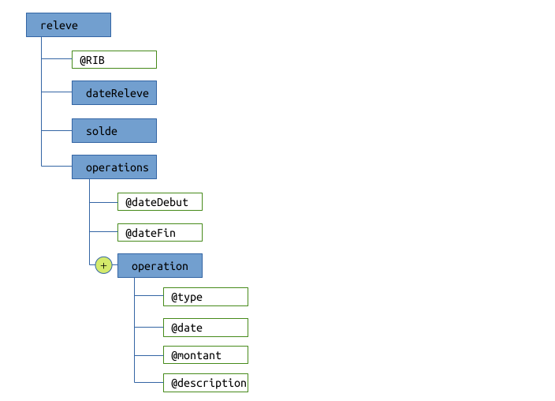
    <h2>A2- Structure DTD</h2>
    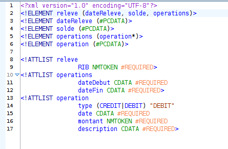
    <h2>A2- Exemple de document XML valide par le DTD</h2>
    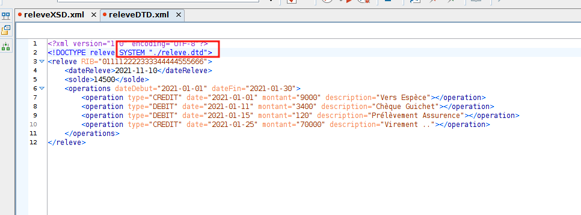
    <h2>A3- Schéma XML</h2>
    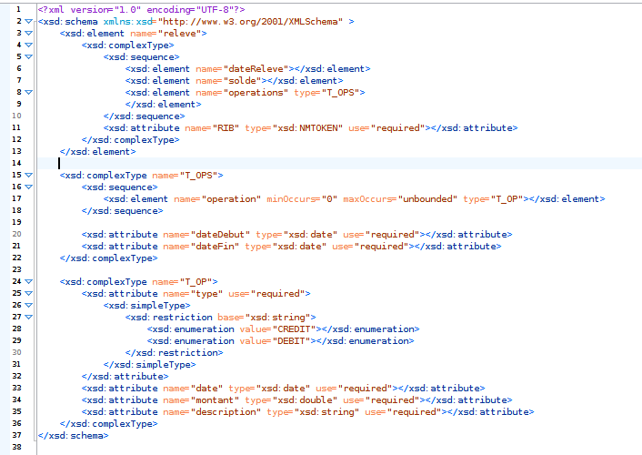
    <h2>A3- Document XML valide par le schéma XML</h2>
    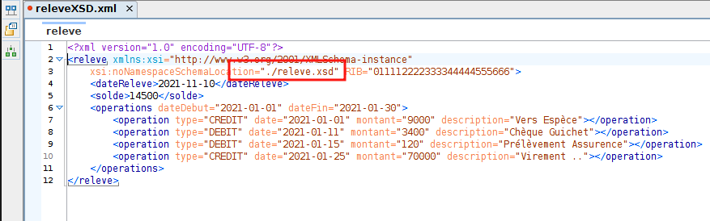
    <h2>A4- Affichage de toutes les opérations à l'aide de la feuille de style XSL.</h2>
    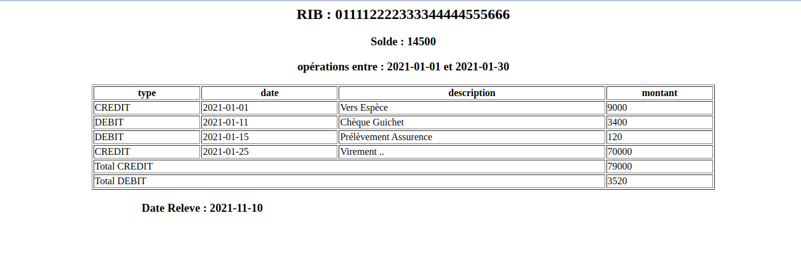
    <h2>A5- Affichage des opérations de CRÉDIT à l'aide de la feuille de style XSL.</h2>
    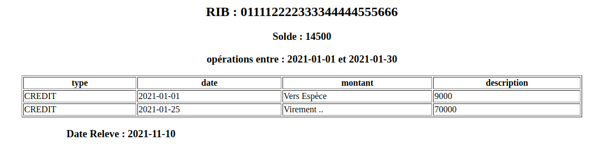
    <h2>B3- La sérialisation d'un objet Java en un document XML.</h2>
    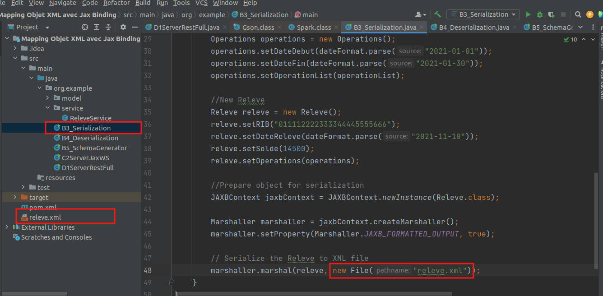
    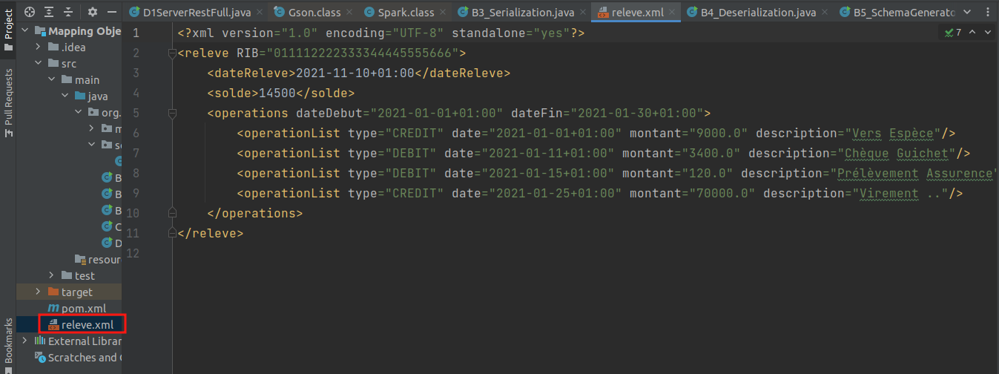
    <h2>B4- La desérialisation d'un document XML vers un objet Java.</h2>
    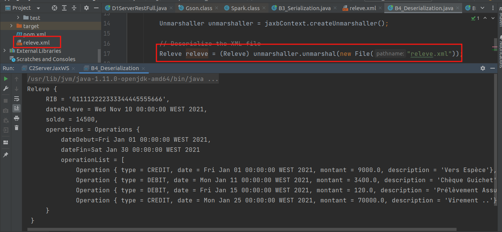
    <h2>B5- La création du schéma XML à l'aide d'une application Java.</h2>
    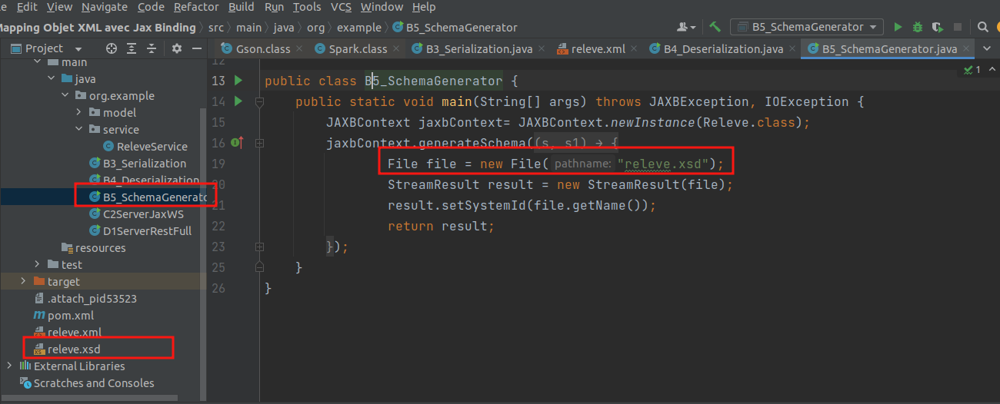
    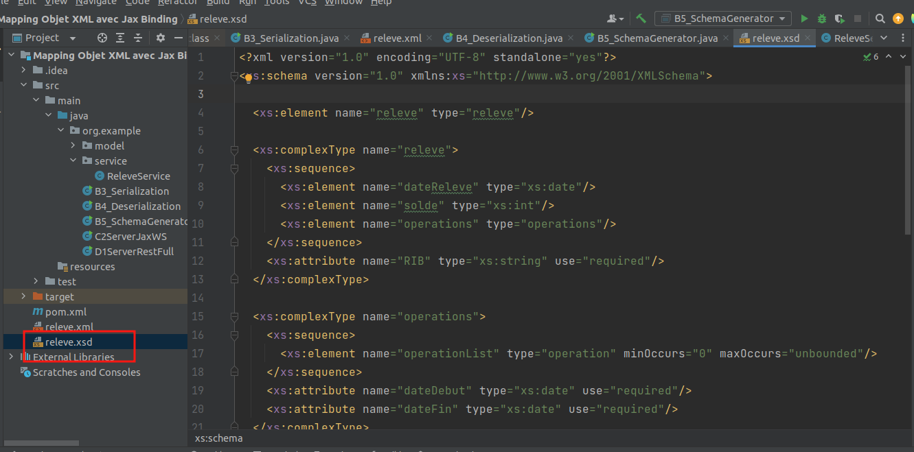
    <h2>C2- serveur JaxWS.</h2>
    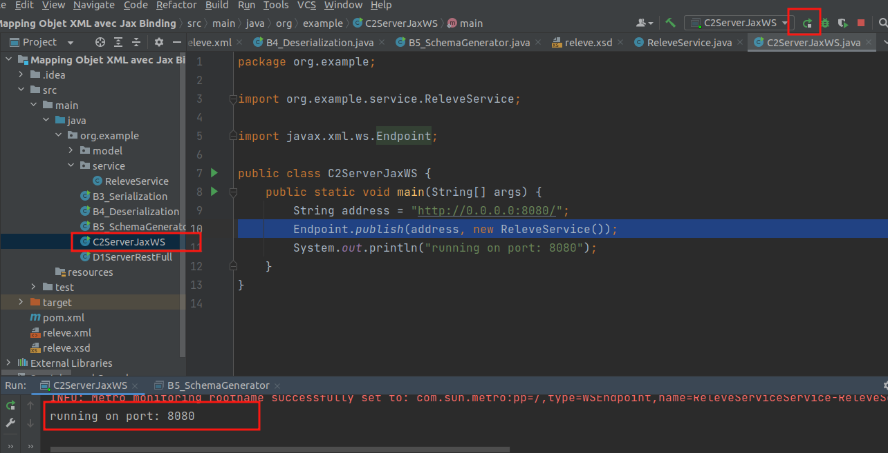
    <h2>C3- Analysation du WSDL en utilisant Google chrome.</h2>
    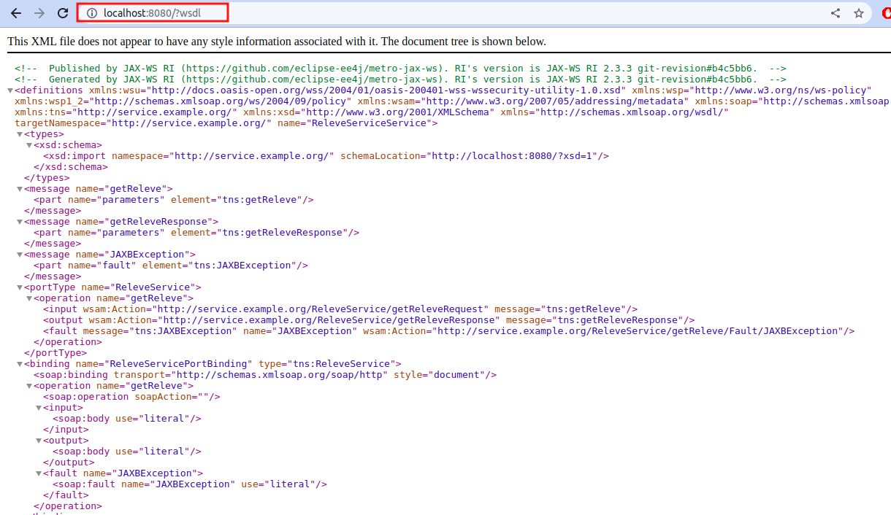
    <h2>C4- Test du Web services en utilisant SoapUI.</h2>
    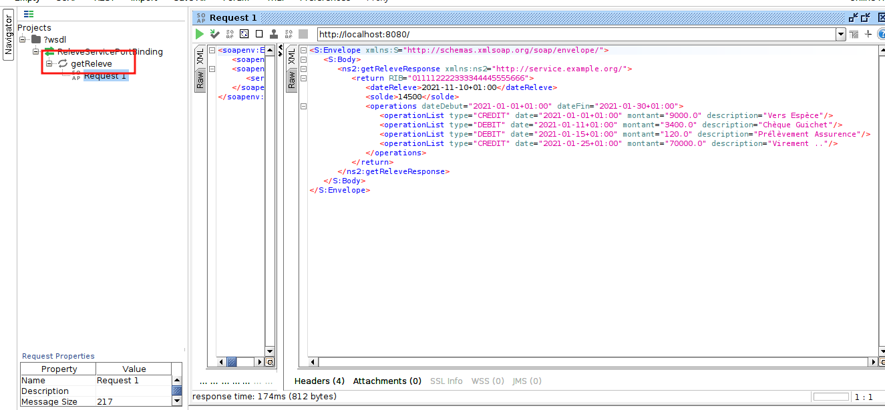
    <h2>C5- Client SOAP Java</h2>
    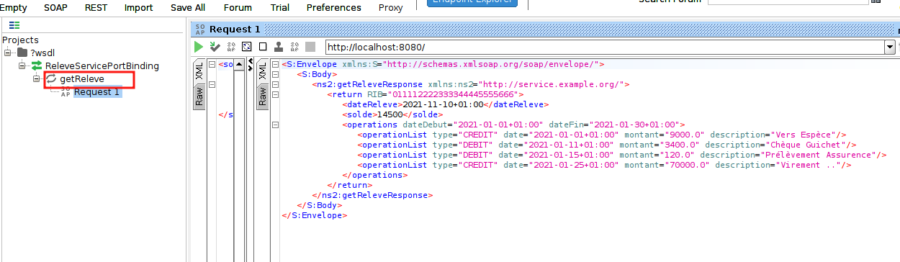
    <h2>D1- Web service RESTFul</h2>
    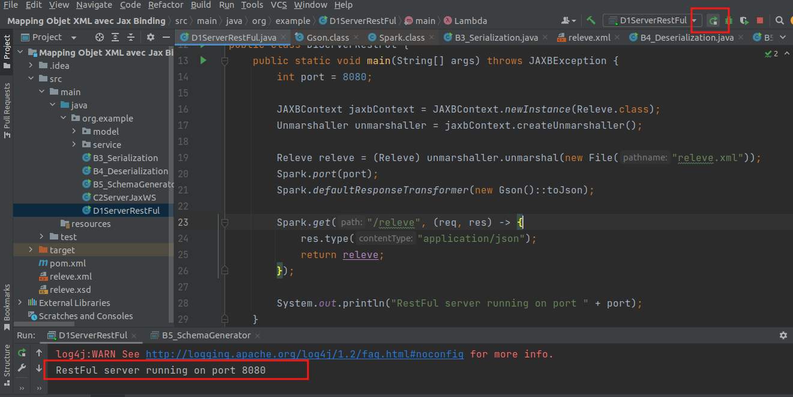
    <h2>D2- Test du Web services en utilisant Postman.</h2>
    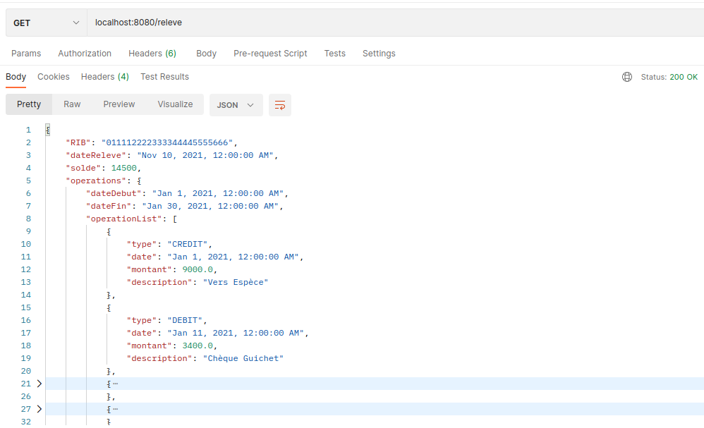
    <h2>D3- Client RestFul Java.</h2>
    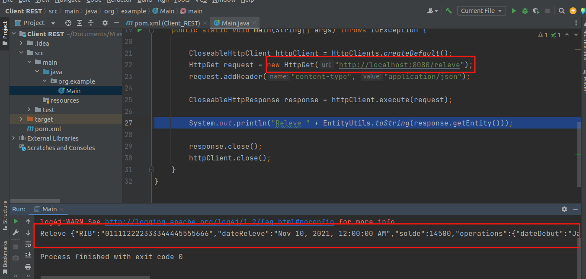
</body>
</html>